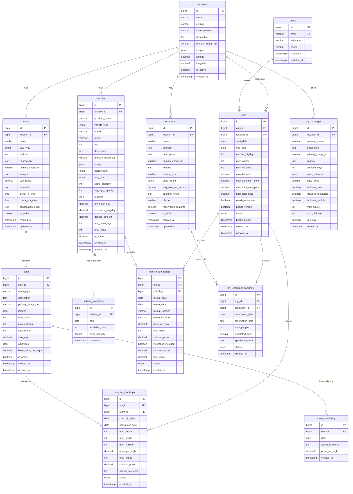

```mermaid
erDiagram
    users ||--o{ trips : creates
    locations ||--o{ stays : "has"
    locations ||--o{ restaurants : "has"
    locations ||--o{ vehicles : "has"
    locations ||--o{ trip_packages : "offers"
    locations ||--o{ trips : "destination"

    stays ||--o{ rooms : contains
    rooms ||--o{ room_availability : "has availability"
    rooms ||--o{ trip_stay_bookings : "booked in"

    vehicles ||--o{ vehicle_availability : "has availability"
    vehicles ||--o{ trip_vehicle_rentals : "rented in"

    restaurants ||--o{ trip_restaurant_bookings : "reserved in"

    trips ||--o{ trip_stay_bookings : includes
    trips ||--o{ trip_restaurant_bookings : includes
    trips ||--o{ trip_vehicle_rentals : includes

    users {
        bigint id PK
        varchar email UK
        varchar full_name
        varchar phone
        timestamp created_at
        timestamp updated_at
    }

    locations {
        bigint id PK
        varchar name
        varchar country
        varchar state_province
        text description
        varchar primary_image_url
        json images
        decimal latitude
        decimal longitude
        boolean is_active
        timestamp created_at
    }

    stays {
        bigint id PK
        bigint location_id FK
        varchar name
        enum stay_type
        text address
        text description
        varchar primary_image_url
        json images
        decimal star_rating
        json amenities
        time check_in_time
        time check_out_time
        text cancellation_policy
        boolean is_active
        timestamp created_at
        timestamp updated_at
    }

    rooms {
        bigint id PK
        bigint stay_id FK
        varchar room_type
        text description
        varchar primary_image_url
        json images
        int max_adults
        int max_children
        int total_rooms
        decimal size_sqm
        json amenities
        decimal base_price_per_night
        boolean is_active
        timestamp created_at
        timestamp updated_at
    }

    room_availability {
        bigint id PK
        bigint room_id FK
        date date
        int available_rooms
        decimal price_per_night
        timestamp created_at
    }

    restaurants {
        bigint id PK
        bigint location_id FK
        varchar name
        text address
        text description
        varchar primary_image_url
        json images
        varchar cuisine_type
        enum price_range
        decimal avg_cost_per_person
        json opening_hours
        varchar phone
        boolean reservation_required
        boolean is_active
        timestamp created_at
        timestamp updated_at
    }

    vehicles {
        bigint id PK
        bigint location_id FK
        varchar provider_name
        enum vehicle_type
        varchar brand
        varchar model
        int year
        text description
        varchar primary_image_url
        json images
        enum transmission
        enum fuel_type
        int seats_capacity
        int luggage_capacity
        json features
        decimal price_per_day
        decimal insurance_per_day
        decimal deposit_amount
        int min_driver_age
        int total_units
        boolean is_active
        timestamp created_at
        timestamp updated_at
    }

    vehicle_availability {
        bigint id PK
        bigint vehicle_id FK
        date date
        int available_units
        decimal price_per_day
        timestamp created_at
    }

    trips {
        bigint id PK
        bigint user_id FK
        bigint location_id FK
        date start_date
        date end_date
        int number_of_days
        int num_adults
        int num_children
        decimal max_budget
        decimal estimated_min_price
        decimal estimated_max_price
        decimal final_total_price
        boolean needs_restaurant
        boolean needs_vehicle
        enum status
        timestamp booking_date
        timestamp created_at
        timestamp updated_at
    }

    trip_stay_bookings {
        bigint id PK
        bigint trip_id FK
        bigint room_id FK
        date check_in_date
        date check_out_date
        int num_rooms
        int num_adults
        int num_children
        decimal price_per_night
        int total_nights
        decimal subtotal_price
        text special_requests
        enum status
        timestamp created_at
    }

    trip_restaurant_bookings {
        bigint id PK
        bigint trip_id FK
        bigint restaurant_id FK
        date reservation_date
        time reservation_time
        int num_people
        decimal estimated_cost
        text special_requests
        enum status
        timestamp created_at
    }

    trip_vehicle_rentals {
        bigint id PK
        bigint trip_id FK
        bigint vehicle_id FK
        date pickup_date
        date return_date
        varchar pickup_location
        varchar return_location
        decimal price_per_day
        int total_days
        decimal subtotal_price
        boolean insurance_included
        decimal insurance_cost
        decimal total_price
        enum status
        timestamp created_at
    }

    trip_packages {
        bigint id PK
        bigint location_id FK
        varchar package_name
        text description
        varchar primary_image_url
        json images
        int duration_days
        enum price_category
        decimal base_price
        boolean includes_stay
        boolean includes_restaurant
        boolean includes_vehicle
        int max_adults
        int max_children
        boolean is_active
        timestamp created_at
    }
```
