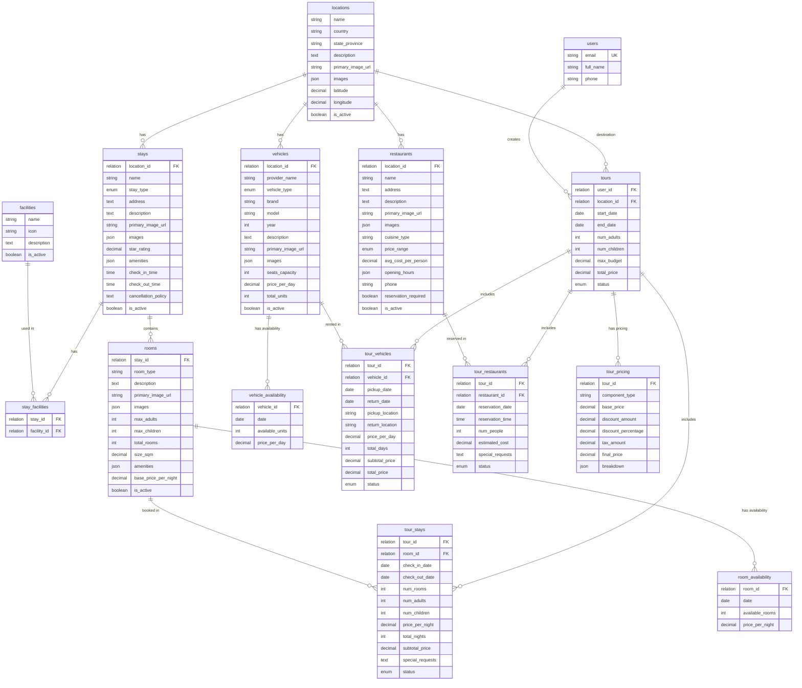

```mermaid
erDiagram
    users ||--o{ tours : creates
    locations ||--o{ stays : "has"
    locations ||--o{ restaurants : "has"
    locations ||--o{ vehicles : "has"
    locations ||--o{ tours : "destination"

    facilities ||--o{ stay_facilities : "used in"
    stays ||--o{ stay_facilities : "has"
    stays ||--o{ rooms : contains

    rooms ||--o{ room_availability : "has availability"
    rooms ||--o{ tour_stays : "booked in"

    vehicles ||--o{ vehicle_availability : "has availability"
    vehicles ||--o{ tour_vehicles : "rented in"

    restaurants ||--o{ tour_restaurants : "reserved in"

    tours ||--o{ tour_stays : includes
    tours ||--o{ tour_restaurants : includes
    tours ||--o{ tour_vehicles : includes

    tours ||--o{ tour_pricing : "has pricing"

    users {
        string email UK
        string full_name
        string phone
    }

    locations {
        string name
        string country
        string state_province
        text description
        string primary_image_url
        json images
        decimal latitude
        decimal longitude
        boolean is_active
    }

    facilities {
        string name
        string icon
        text description
        boolean is_active
    }

    stays {
        relation location_id FK
        string name
        enum stay_type
        text address
        text description
        string primary_image_url
        json images
        decimal star_rating
        json amenities
        time check_in_time
        time check_out_time
        text cancellation_policy
        boolean is_active
    }

    stay_facilities {
        relation stay_id FK
        relation facility_id FK
    }

    rooms {
        relation stay_id FK
        string room_type
        text description
        string primary_image_url
        json images
        int max_adults
        int max_children
        int total_rooms
        decimal size_sqm
        json amenities
        decimal base_price_per_night
        boolean is_active
    }

    room_availability {
        relation room_id FK
        date date
        int available_rooms
        decimal price_per_night
    }

    restaurants {
        relation location_id FK
        string name
        text address
        text description
        string primary_image_url
        json images
        string cuisine_type
        enum price_range
        decimal avg_cost_per_person
        json opening_hours
        string phone
        boolean reservation_required
        boolean is_active
    }

    vehicles {
        relation location_id FK
        string provider_name
        enum vehicle_type
        string brand
        string model
        int year
        text description
        string primary_image_url
        json images
        int seats_capacity
        decimal price_per_day
        int total_units
        boolean is_active
    }

    vehicle_availability {
        relation vehicle_id FK
        date date
        int available_units
        decimal price_per_day
    }

    tours {
        relation user_id FK
        relation location_id FK
        date start_date
        date end_date
        int num_adults
        int num_children
        decimal max_budget
        decimal total_price
        enum status
    }

    tour_stays {
        relation tour_id FK
        relation room_id FK
        date check_in_date
        date check_out_date
        int num_rooms
        int num_adults
        int num_children
        decimal price_per_night
        int total_nights
        decimal subtotal_price
        text special_requests
        enum status
    }

    tour_restaurants {
        relation tour_id FK
        relation restaurant_id FK
        date reservation_date
        time reservation_time
        int num_people
        decimal estimated_cost
        text special_requests
        enum status
    }

    tour_vehicles {
        relation tour_id FK
        relation vehicle_id FK
        date pickup_date
        date return_date
        string pickup_location
        string return_location
        decimal price_per_day
        int total_days
        decimal subtotal_price
        decimal total_price
        enum status
    }

    tour_pricing {
        relation tour_id FK
        string component_type
        decimal base_price
        decimal discount_amount
        decimal discount_percentage
        decimal tax_amount
        decimal final_price
        json breakdown
    }
```
